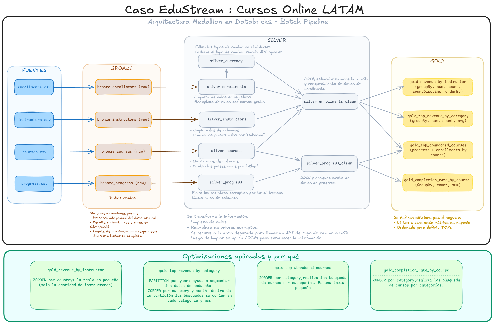
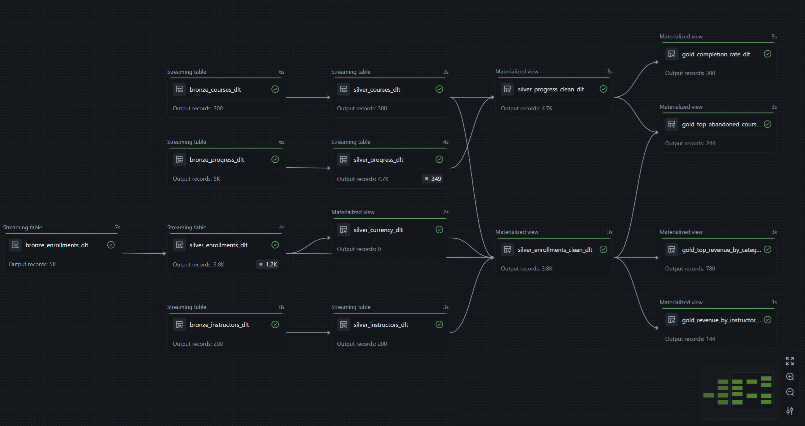
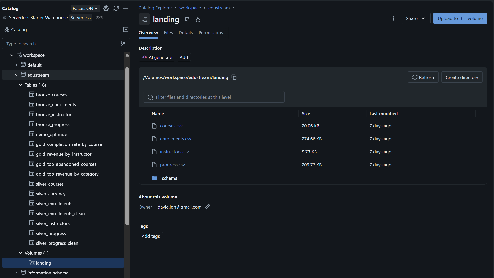

# 🎓 EduStream — Pipeline Medallion en Databricks

Pipeline de datos end-to-end bajo arquitectura **Medallion** (Bronze → Silver → Gold) para EduStream, una plataforma ficticia de cursos online en LATAM. Incluye ingesta incremental, limpieza, validación de calidad, enriquecimiento con conversión de divisas y métricas de negocio.

## 📊 Dataset
EduStream — 4 archivos CSV batch diarios:
- `enrollments.csv` — inscripciones de usuarios (~5,000)
- `courses.csv` — catálogo de cursos (~300)
- `progress.csv` — progreso por usuario/curso (~5,000)
- `instructors.csv` — datos de instructores (~200)

## 📦 Generar los datos

Este repositorio **no incluye los archivos CSV** (son datos generados, no versionados). El script `generate_data_edustream.py` los crea en una carpeta local `data/`.

1. Ejecuta el script en tu máquina:  `python generate_data_edustream.py`
2. Sube los 4 CSV de `data/` al Volume de Databricks vía la UI: **Catalog → workspace → edustream → landing → Upload**, con destino `/Volumes/workspace/edustream/landing/`.

> ⚠️ Git versiona el **código**, no los datos. Los CSV se cargan al Volume de Databricks de forma independiente.

## 🛠️ Stack tecnológico
- **Databricks Free Edition** + Unity Catalog
- **Delta Lake** — Time Travel, OPTIMIZE, ZORDER, VACUUM
- **Delta Live Tables (DLT)** — pipeline declarativo con expectativas de calidad
- **PySpark**
- **API** [open.er-api.com](https://open.er-api.com) — conversión de divisas a USD

## 🏗️ Arquitectura


## ⬇️ Obtener el proyecto

**Opción A — Clonar con Git:**

​```bash
git clone https://github.com/david-ldh/edustream-pipeline-DLDH.git
​```

**Opción B — Sin Git:** clic en el botón verde **Code → Download ZIP** y descomprime.

> 📌 **Nota:** clonar/descargar baja los archivos a tu PC, pero los notebooks
> (`.ipynb`) se ejecutan en **Databricks**, no localmente. Tras obtener el repo,
> impórtalos a tu workspace: **Workspace → Import → File**, y selecciona cada `.ipynb`.
> El script `generate_data_edustream.py` sí se ejecuta en tu PC (genera los CSV locales).

## 🚀 Cómo reproducirlo en Databricks Free Edition

1. **Crear cuenta** en [Databricks Free Edition](https://www.databricks.com/learn/free-edition) y abrir el workspace.
2. **Crear el schema y el Volume** en Unity Catalog (ver SQL abajo).
3. **Generar y subir los datos** al Volume (ver sección "Generar los datos").
4. **Importar y ejecutar** `S06_EduStream_Pipeline.ipynb` celda por celda — Paso 1 (tablas Delta), Paso 2 (Time Travel), Paso 4 (OPTIMIZE / ZORDER / VACUUM).
5. **Crear el pipeline DLT**: Jobs & Pipelines → Create → ETL Pipeline → asignar `edustream_pipeline_dlt.ipynb` y ejecutar con **Full refresh all** la primera vez.

### SQL de preparación

​```sql
CREATE SCHEMA IF NOT EXISTS workspace.edustream;
CREATE VOLUME IF NOT EXISTS workspace.edustream.landing;
​```

## 📈 Métricas de negocio (capa Gold)
| Métrica | Tabla |
|---|---|
| Completion rate por curso | `gold_completion_rate_by_course` |
| Revenue por instructor | `gold_revenue_by_instructor` |
| Cursos más abandonados | `gold_top_abandoned_courses` |
| Top categorías por revenue | `gold_top_revenue_by_category` |

## 📸 Capturas

### Grafo del pipeline DLT en ejecución


### Catalog Explorer — schema edustream


## 📁 Estructura del repositorio

​```
edustream-pipeline-DLDH/
├── S06_EduStream_Pipeline.ipynb      # Notebook principal (Pasos 1, 2, 4)
├── edustream_pipeline_dlt.ipynb      # Pipeline DLT (Paso 3)
├── generate_data_edustream.py        # Generador de datos
├── docs/
│   ├── EduStream-Arquitectura-Medallion.png
│   ├── pipeline_edustream_DAG.png
│   └── catalog_explorer.png
├── .gitignore
└── README.md
​```

> La carpeta `data/` (con los CSV generados) se crea localmente al ejecutar el script,
> pero **no se versiona** (está en `.gitignore`). Ver la sección "Generar los datos".

## 👤 Autor
David — david.ldh@gmail.com